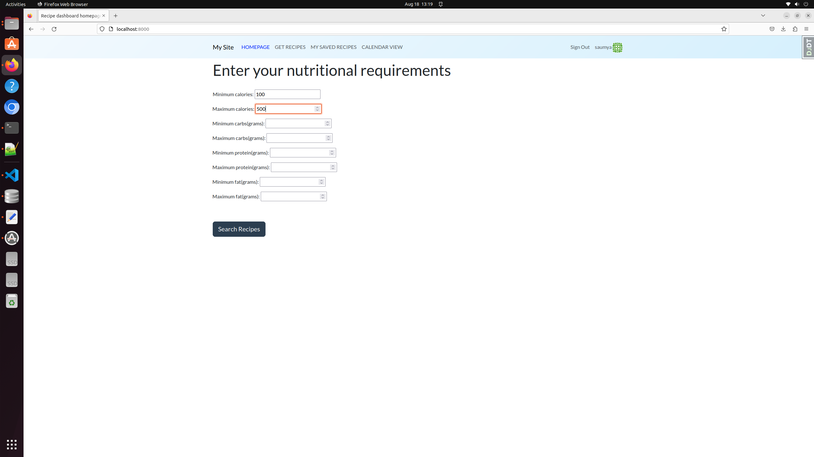
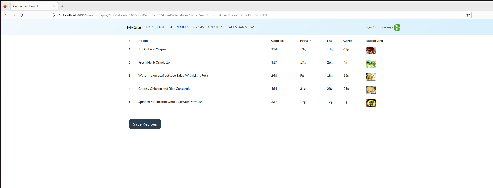
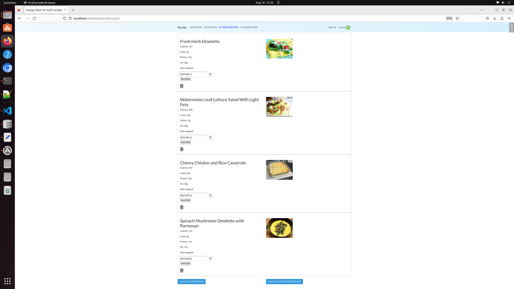
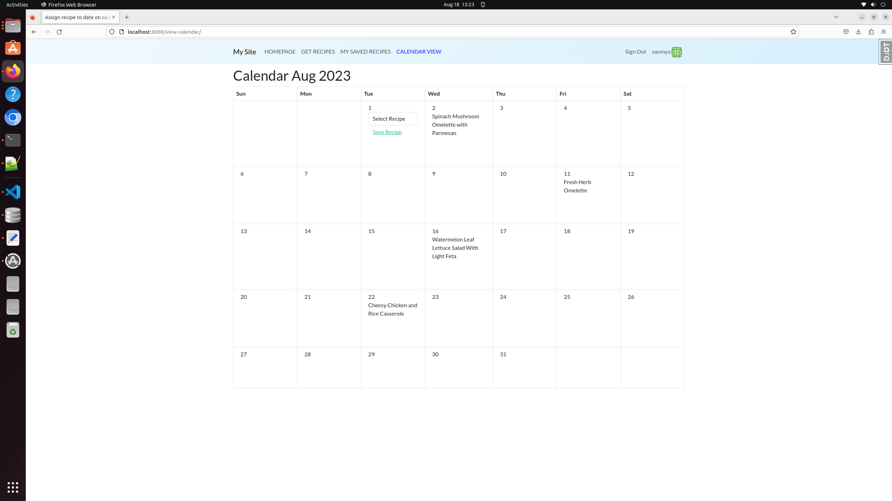
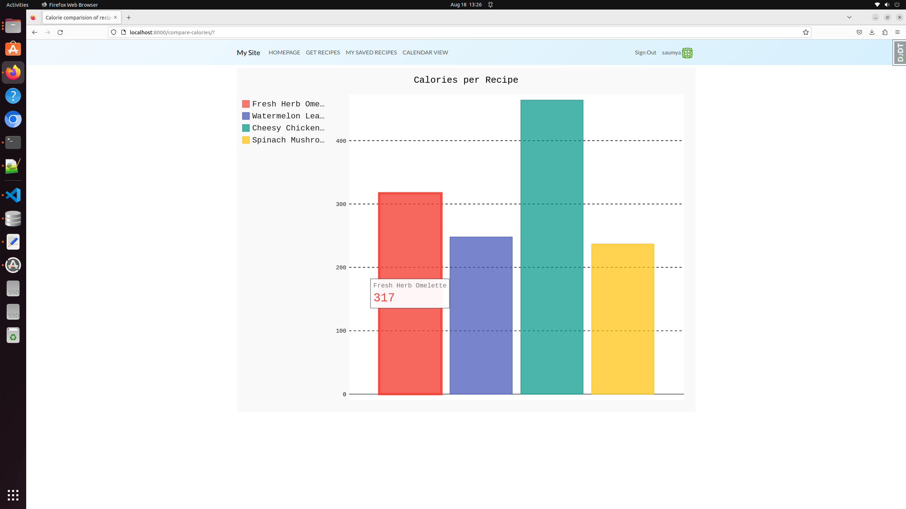
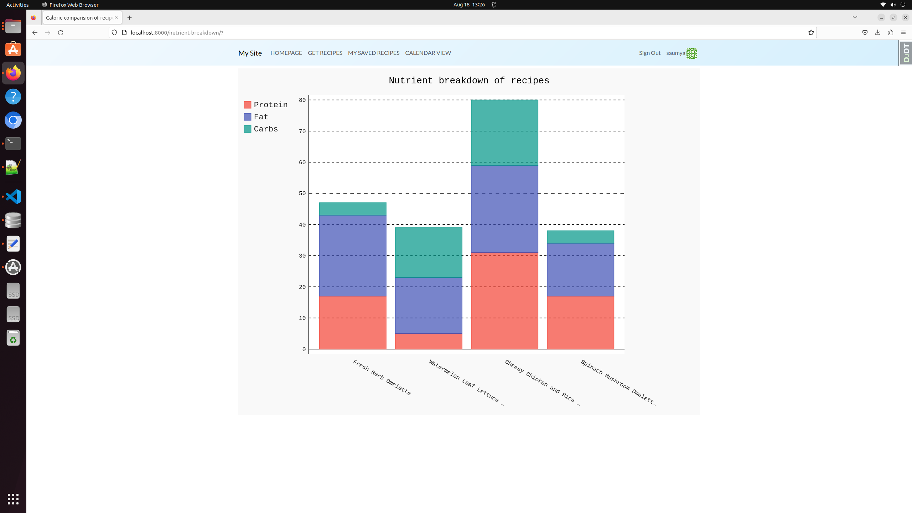

# Diet Planner Website
## Interface Description
1. User can login and enter their nutritional requirements on the homepage. Click on Search Recipes button.
 <br />

2. Spoonacular API is called with the parameters provided by the user. A list of recipes is retrieved and displayed on the Get Recipes page. User can save these recipes to the database.
 <br />

3. A list of saved recipes is displayed with an option to save a date corresponding to the recipe. <br />
   If the user does not like a recipe, they can delete the recipe using the delete-icon. <br />
   'Calorie Comparision' and 'Macro Nutrient Breakdown' buttons are provided to compare the calories of saved recipes and check the Protein/Fat/Carbs breakdown of each recipe.
 <br />

4. Calendar of current month/year is displayed. Saved recipes are displayed in a dropdown if the user hovers over a date. User can select any one recipe and click on 'Save Recipe' link to assign a recipe to that date.
 <br />

5. Calories per Recipe chart is displayed on click of 'Calorie Comparision' button. Plotted using Pygal.
 <br />

6. Macro Nutrient Breakdown chart is displayed on click of 'Macro Nutrient Breakdown' button. Plotted using Pygal.
 <br />

  
## References
https://github.com/kickstartcoding/django-kcproject-starter

### Running locally

1. Download project from Github using:
 ```
 git clone https://github.com/saumyasucharita/diet-planner.git
 ```

2. Go into the newly created project, and use `pipenv` to get your virtualenv
setup:
```
cd diet-planner
pipenv shell
pipenv install --skip-lock --dev
```

3. Make migrations as such:
```
python manage.py makemigrations accounts
```

4. Run the migrations to actually create the SQLite database:
```
python manage.py migrate
```

5. Get the server running:
```
python manage.py runserver
```

### File structure

Directory structure description below:

```python
[name_of_project]/
    - config/
        - base.py          # Stores most settings
        - local.py         # Stores settings only for local dev
        - production.py    # Stores settings only used by production (e.g. Heroku)
    - urls.py              # Global urls.py, in turn includes urls.py in apps

- apps/                    # A directory to store all our custom apps
    - accounts/            # An example custom app that includes sign-up and log-in
        - models.py        # Customized user class is here
        - urls.py          # URLs for sign-up and log-in pages
        - views.py         # Views for sign-up and log-in pages
        - forms.py         # Form for editing user profile, sign-up
        - templates/       # Templates for user profile stuff
    - core/                # An example custom app that has some static pages
        - static/          # Static files
        - templates/       # Core templates, including base templates
        - models.py        # Models for the Diet Planner App 
        - urls.py          # URLs for navigating through the website
        - views.py         # Views for the Diet Planner App 
- manage.py                # Entry point
- Pipfile                  # Development requirements
```
